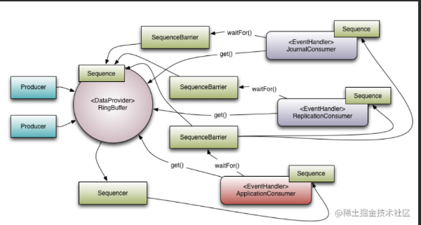
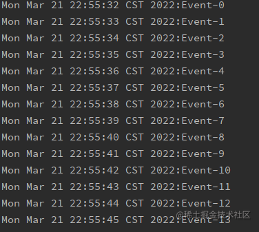

>最近工作中参与了一个随机数分发平台的设计，考虑如何才能实现该平台的高并发性能，在技术实现选型中首先参考了百度的[uid-generator](https://github.com/baidu/uid-generator)，其采用了双`RingBuffer`的实现形式，估计uid-generator的双`RingBuffer`也是借鉴了Disruptor的实现思想吧。因此，本系列文章我们一起来探究学习下2011年获得了Duke’s 程序框架创新奖的`Disruptor`框架。


# 1 前言
Martin Fowler在自己网站上写了一篇LMAX架构的文章，LMAX是一种运行在JVM平台上的新型零售金融交易平台，该平台能够以很低的延迟产生大量交易，大量交易是多少呢？单个线程达到了每秒处理6百万订单的TPS，虽然业务逻辑是纯内存操作，但每秒处理6百万订单的TPS已经高的惊人了。那么，是什么支撑了LMAX单个线程能达到每秒处理6百万订单呢？答案就是`Disruptor`。

`Disruptor`是一个开源的并发框架，其于2011年获得了Duke’s 程序框架创新奖，采用事件源驱动方式，能够在无锁的情况下实现网络的Queue并发操作。

# 2 Disruptor框架简介

`Disruptor`框架内部核心的数据结构是`Ring Buffer`，`Ring Buffer`是一个环形的数组，`Disruptor`框架以`Ring Buffer`为核心实现了异步事件处理的高性能架构；JDK的`BlockingQueue`相信大家都用过，其是一个阻塞队列，内部通过锁机制实现生产者和消费者之间线程的同步。跟`BlockingQueue`一样，`Disruptor`框架也是围绕`Ring Buffer`实现生产者和消费者之间数据的交换，只不过`Disruptor`框架性能更高，笔者曾经在同样的环境下拿`Disruptor`框架跟`ArrayBlockingQueue`做过性能测试，`Disruptor`框架处理数据的性能比`ArrayBlockingQueue`的快几倍。

`Disruptor`框架性能为什么会更好呢？其有以下特点：

1. 预加载内存可以理解为使用了内存池；
2. 无锁化
3. 单线程写
4. 消除伪共享
5. 使用内存屏障
6. 序号栅栏机制

# 3 相关概念



**Disruptor**:是使用`Disruptor`框架的核心类，持有`RingBuffer`、消费者线程池、消费者集合`ConsumerRepository`和消费者异常处理器`ExceptionHandler`等引用；

**Ring Buffer**: `RingBuffer`处于`Disruptor`框架的中心位置，其是一个环形数组，环形数组的对象采用预加载机制创建且能重用，是生产者和消费者之间交换数据的桥梁，其持有`Sequencer`的引用；


**Sequencer**: `Sequencer`是`Disruptor`框架的核心，实现了所有并发算法，用于生产者和消费者之间快速、正确地传递数据，其有两个实现类`SingleProducerSequencer`和`MultiProducerSequencer`。

**Sequence**:`Sequence`被用来标识`Ring Buffer`和消费者`Event Processor`的处理进度，每个消费者`Event Processor`和`Ring Buffer`本身都分别维护了一个`Sequence`，支持并发操作和顺序写，其也通过填充缓存行的方式来消除伪共享从而提高性能。

**Sequence Barrier**:`Sequence Barrier`即为序号屏障，通过追踪生产者的`cursorSequence`和每个消费者（` EventProcessor`）的`sequence`的方式来协调生产者和消费者之间的数据交换进度，其实现类`ProcessingSequenceBarrier`持有的`WaitStrategy`等待策略类是实现序号屏障的核心。

**Wait Strategy**:`Wait Strategy`是决定消费者如何等待生产者的策略方式，当消费者消费速度过快时，此时是不是要让消费者等待下，此时消费者等待是通过锁的方式实现还是无锁的方式实现呢？

**Event Processor**:`Event Processor`可以理解为消费者线程，该线程会一直从`Ring Buffer`获取数据来消费数据，其有两个核心实现类：`BatchEventProcessor`和`WorkProcessor`。

**Event Handler**:`Event Handler`可以理解为消费者实现业务逻辑的`Handler`，被`BatchEventProcessor`类引用，在`BatchEventProcessor`线程的死循环中不断从`Ring Buffer`获取数据供`Event Handler`消费。

**Producer**:生产者，一般用`RingBuffer.publishEvent`来生产数据。


# 4 入门DEMO
```java
// LongEvent.java
public class LongEvent
{
    private long value;

    public void set(long value)
    {
        this.value = value;
    }

    public long get() {
        return this.value;
    }
}
```

```java
// LongEventFactory.java
public class LongEventFactory implements EventFactory<LongEvent>
{
    @Override
    public LongEvent newInstance()
    {
        return new LongEvent();
    }
}
```

```java
// LongEventHandler.java
public class LongEventHandler implements EventHandler<LongEvent>
{
    @Override
    public void onEvent(LongEvent event, long sequence, boolean endOfBatch)
    {
        System.out.println(new Date() + ":Event-" + event.get());
    }
}
```

```java
// LongEventTranslatorOneArg.java
public class LongEventTranslatorOneArg implements EventTranslatorOneArg<LongEvent, ByteBuffer> {
    @Override
    public void translateTo(LongEvent event, long sequence, ByteBuffer buffer) {
        event.set(buffer.getLong(0));
    }
}
```

```java
// LongEventMain.java
public class LongEventMain
{
    public static void main(String[] args) throws Exception
    {
        int bufferSize = 1024;
        final Disruptor<LongEvent> disruptor = new Disruptor<LongEvent>(
                new LongEventFactory(),
                bufferSize,
                Executors.newSingleThreadExecutor(),
                ProducerType.SINGLE,
                new YieldingWaitStrategy()
        );

        disruptor.handleEventsWith(new LongEventHandler());
        disruptor.start();


        RingBuffer<LongEvent> ringBuffer = disruptor.getRingBuffer();
        ByteBuffer bb = ByteBuffer.allocate(8);
        for (long l = 0; true; l++)
        {
            bb.putLong(0, l);
            ringBuffer.publishEvent(new LongEventTranslatorOneArg(), bb);
            Thread.sleep(1000);
        }
    }
}
```
输出结果：




参考：https://lmax-exchange.github.io/disruptor/user-guide/index.html


**若您觉得不错，请无情的转发和点赞吧！**

【源码笔记】Github地址：

https://github.com/yuanmabiji/Java-SourceCode-Blogs

